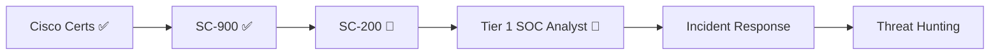

<!-- Palitan ang YOUR_GITHUB_USERNAME sa lahat ng links (Ctrl+H) -->

 

---

## 👋 About Me

> *"Detect early. Investigate thoroughly. Document everything."*

Hi, I'm **Bright**, an IT student at **Polytechnic University of the Philippines (PUP) – Parañaque** targeting career as a **SOC (Security Operations Center) Analyst**.

- 🎯 **Goal:** Tier 1 SOC Analyst → Incident Response → Threat Hunting
- 🔐 **Currently:** Leveling up in Microsoft security (SC-900 ✅ → SC-200 next)
- 🛠️ **Also a builder:** I've shipped full-stack web projects, so I understand how apps work *and* how they get attacked
- 🌱 **Learning style:** Study, build, document, then simplify

---

## 🏅 Certifications

| Status | Certification | Issuer |
| :---: | --- | --- |
| ✅ | **SC-900:** Security, Compliance & Identity Fundamentals | Microsoft |
| ✅ | Introduction to Cybersecurity | Cisco |
| ✅ | Cyber Threat Management | Cisco |
| ✅ | Networking Basics | Cisco |
| ✅ | Digital Safety and Security Awareness | Cisco |
| ✅ | Ethical Hacking & Penetration Testing | Iadale Learning Center |
| 🔄 | **SC-200:** Security Operations Analyst | Microsoft *(next up)* |

---

## ⚙️ Tech & Tools Matrix

**🔐 Security Tools**

**🖥️ Operating Systems & Infrastructure**

**💻 Development**

---

## 🚀 Featured Projects

<table>
<tr>
<td width="50%" valign="top">

### 🔎 Reunited
**Capstone / Thesis Project**

Web-based **lost-and-found management system** for PUP Parañaque with a RAG-powered AI chatbot assistant.

- Student & Admin portals
- Claim submission and staff approval workflow
- Similarity-matching of lost and found items
- AI chatbot for item inquiries

`PHP` `MySQL` `JavaScript` `OpenAI API` `HTML` `CSS` 

</td>
<td width="50%" valign="top">

### 🛒 ComputerLab
**Online Shop System**

Full-stack **e-commerce web app** with a customer storefront and an admin dashboard.

- Product catalog and ordering
- Admin inventory management
- Order tracking and management
- Role-based pages (customer / admin)

`HTML` `CSS` `JavaScript` `PHP` `MySQL`

</td>
</tr>
</table>

---

## 🗺️ Career Roadmap

---

## 📊 GitHub Stats

---

## 🤝 Let's Connect

Hiring for an entry-level **SOC / Blue Team** role, or want to swap study notes on **SC-200, KQL, and Sentinel**? Message me anytime.

🛡️ *Stay curious. Stay vigilant. Defend forward.*

